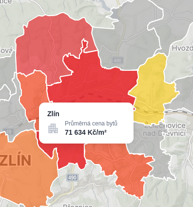

# :cyclone: Ako by sme na to išli :

## Dotaznik (Čo budeme potrebovať) :
- Rozloha pozemku v m^2
- Adresa (Kraj,Mesto,Ulica)

### Budu dve možnosti :
1. Scrapovanie dát ,ktoré si uložime do Database/lokálne na serveri
2. Real-time request building
Pre obe možnosti by sme ťahali dáta zo stránky **SREALITY** ,ktorá je pod **SEZNAMOM** (ževraj v Česku nemá konkurenciu zdroj [tu](https://dspace.cvut.cz/bitstream/handle/10467/103384/F8-BP-2021-Malach-Ondrej-thesis.pdf?sequence=-1&isAllowed=y))

# :cyclone: 1. Scrapovanie dát

## Yapping :
### Pros
- Možno rychlejšie vyhladávanie
- Sustainability keby dostaneme IP ban za priliš vela requestov zo scrapovania (Nepravdepodobné -> odds may be low but never zero)
- Dobrá rozšíritelnosť do budúcna keby si chceme viesť nejakú osobnú cenovú mapu 
### Cons
- Cena hostingu DB
- Logistický overhead -> Musime mať nahostenú databázu ,ktorá bude potrebovať hýčkanie a opateru + nejake migračné veci keby si zrazu zmyslíme že chceme dáta ukladať inak
- Trošku zložitejšia implementácia

# :cyclone: 2. Real-time request building
## Yapping :
### Pros
- Menší logistický overhead -> žiadna DB všetko by sa robilo u clienta kde by sme len my zadefinovali ako by sa poskladal request podla vyplneného dotazníku
- Nehrozí asi ani IP ban od **SREALITY** lebo request by si robil sám uživatel
- Menšia implementačná záležitosť

### Cons
- Unsustainability -> keby sa stane ,že nás zablokujú alebo by bol nejaký súdny spor ,že využivame ich **API** bez ich súhlasu (Nemajú ale nič napisané v ich **TERMS OF USE** o tom že by sme nemohli) tak vlastne budeme v prdeli

# :mega: Vytváranie requestov

- Prevolávali by sme vlastne **SREALITY API** s ich verejne dostupnými ***endpointami*** (tj. ,že tam nie je žiadne prihlasovanie/token/autorizacia môže si to prevolať hocikto s počitačom tak prečo by sme nemohli my xd) 

## Teoria request buildingu
- Takto vyzerá základná **URL adresa** `https://www.sreality.cz`
- Dalšie odstavce budu len ako keby prídavky k tejto adrese ,čo všetko vieme získať od nich
- **SREALITY** použiva pojmy -> 

| Ward (Najmenši uzemný celok) | Municipality | District |
|----------|----------|----------|
| Najpresnejšie   |  50/50  | Najmenej presná cena   |


### `/api/v1/localities/suggest?`
- Týmto vieme zistiť lokalitu z geo. šírky a dĺžky : `lat=50.1055488&lon=14.3949824&lang=cs&limit=10` 

```json 
{
      "discount_show": false,
      "has_matterport_url": false,
      "has_video": false,
      "hash_id": 1976804172,
      "locality": {
        "city": "Zlín",
        "city_seo_name": "zlin",
        "citypart": "Zlín",
        "citypart_seo_name": "zlin",
        "country": "Česká republika",
        "country_id": 112,
        "country_seo_name": "ceska-republika",
        "district": "Zlín",
        "district_id": 38,
        "district_seo_name": "zlin",
        "entity_type": "address",
        "geohash": "u2u8412np9",
        "gps_lat": 49.2266551651213,
        "gps_lon": 17.666337496962,
        "housenumber": null,
        "inaccuracy_type": "ward",
        "municipality": null,
        "municipality_id": 3045,
        "municipality_seo_name": null,
        "quarter": null,
        "quarter_id": -1,
        "quarter_seo_name": null,
        "region": "Zlínský kraj",
        "region_id": 9,
        "region_seo_name": "zlinsky-kraj",
        "street": "",
        "street_id": -1,
        "street_seo_name": null,
        "streetnumber": null,
        "ward": null,
        "ward_id": 14682,
        "ward_seo_name": null
      }
    }
```
v tejto odpovedi môžeš vidieť aj ten 
```json
"inaccuracy_type": "ward",
"ward_id": 14682,
```

- Z tohto vieme zistit **ID wardu/municipality** ,ktoré vieme použiť pri ďalšom requeste

### `/api/v1/price_map/list?category_main_cb=1&date_from=2024-06&date_to=2025-05&locality=region,10`

- `date_from` a `date_to` su len časové údaje o historií

- `&locality=TYP OBLASTI,ID OBLASTI` 

- **TYP OBLASTI** je daný ***ward / municipality / district***

- **ID OBLASTI** je to čo vlastne prvotne nevieme a potrebujeme na to ten request predtým (interné ID **SREALITY**)

- Na základe tohoto vieme už zistiť pomerne presnú cenu nehnutelnosti kde si vytiahneme priemernu cenu z **SREALITY**


### **Ukažka requestu ,ktorý by som použil** 
### ```https://www.sreality.cz/api/v1/price_map/list?category_main_cb=1&date_from=2024-06&date_to=2025-05&locality=ward,14682```

```json
"avg_price_per_sqm": 71635,
```

- Čo sedí aj s ich stránkami :



- To by sme vynásobili počtom m^2 a mali by sme ***približnú cenu*** na hook zákaznika že netrepeme pičoviny
